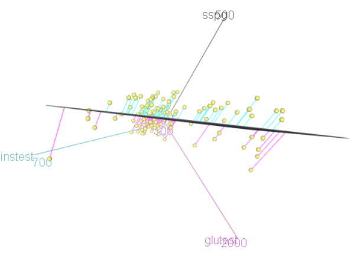
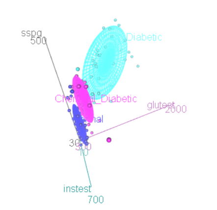

```{r setup, include=FALSE}
knitr::opts_chunk$set(echo = FALSE,  warning=FALSE, message=FALSE, comment="", fig.show = "show", results="show" )
```

-------------------


## Question 1 (15 marks)

a. Explain the meaning of the terms `target population`,  `frame` and `sample` in the context of this study.

The term `target population` refers to the all non-obese adults including those who do not have diabetes.

The study is based on volunteers.  So the term `frame` will refer to the group of people who may have read the advertisement seeking volunteers for the study or a health database of people registered at  the Stanford University and Veterans Administration Hospital.  We are unable to exactly answer which type of frame was employed due to lack of details in the journal article.

The term `sample` refers to the 145 non-obese adults who participated in the study.

b. What assumptions must be made in order to regard the sample as a `representative` one?  Discuss your answer listing possible biases and issues in the selection & collection stages of data collection.

The major assumption for the sample to be representative of all non-obese adults are similar in terms of  carbohydrate  metabolism and any observed variation is attributable to common causes (chance).  Demographic variables such as ethnicity, gender, age etc. are assumed to be part of the common causes.

The study exercises *local control* by excluding known variables such as obesity causing additional risk of poor metabolic outcomes. In other words, some screening of volunteers was done to avoid nuisance variation being added to the measured metabolic variables.  While it is not fully clear how this was done, the authors explain measures such as those taking other medications were not sought to be volunteers.  If volunteers were sought using advertisements, pre-screening becomes crucial.  If the hospital database was used to recruit volunteers, then it is rather easy to exclude obese adults. The article claims that volunteers were not taking any medications  known  to  modify  carbohydrate  metabolism, 
and they had no  clinical or laboratory evidence of  hepatic or cardiovascular  disease.  There were also other steps taken to ensure the effect any nuisance variables do not unduly affect metabolic outcomes. 

In the selection stage, it appears that necessary steps were taken to avoid lack of homogeneity in the study group in terms of metabolic characteristics.  Even though the study included those who had  a  family history of  diabetes, it was assumed that the characteristics of carbohydrate  metabolism remains the same for all.  We need expert knowledge to confirm that there will be only minimal bias will be caused by other (non-clinical) factors such as age.

In the collection stage, standard or established procedures were followed and hence we expect the bias to be minimal.  The main source of bias is due to measurement errors, and this issue is discussed in part (c).

To summarise, the study is unlikely to involve huge bias on measurement of the response variables.

c. Discuss the relevance of the terms `sampling error` and `measurement error` in the context.

The term `sampling error` mainly refers to the variation that arises due to sampling.  Firstly the sample consists of volunteers.  The variation within the 145 non-obese adults can be used to comment on what we expect if a different set of volunteers are used for the study.  If *epsom* samples are taken, we can employ probability models to quantify the sampling variation.  In case of non-epsom samples, we need `a priori` knowledge to generalise the variation.  We would expect that the use of volunteers may not be an issue for a study on  carbohydrate  metabolism.  This may not be the case in general; for example opinion polls.  The second stage of  `sampling error` arises when blood samples are taken and then analytical test subsamples are formed to make measurements on the diagnostic responses (`glufast`, `glutest`, `instest`, `sspg`).  It appears that trimming studies with large coefficients of variation (CV) was done to reduce the impact of analytical testing errors.

The data collection was done on four diagnostic variables from each of the volunteers.  These are `glufast`: fasting plasma glucose level, `glutest`: test plasma glucose level, a measure of glucose intolerance,`instest`: plasma insulin during test, a measure of insulin response to oral glucose, and `sspg`: steady state plasma glucose, a measure of insulin resistance. The authors describe in detail how these measurements were made.  For example,  studies in which the CV  of  the individual SSPG  and SSPI  values were greater than 10%  were excluded from analysis. This suggests that measurement error is the main source of bias and necessary steps were taken to control this bias.  When it comes to measurement bias for `relwt`: relative weight, the bias is actually caused by the method of computing the expected weight, given the person's height.  This variable does not appear to be a function of the metabolic characteristics; so we there may not be any serious bias issues.

Note that the variable `group` is not actually measured but rather assigned using a statistical method called  cluster analysis; see pp.19-20 and also the article summary.  So,  many of the data collection related terms are not directly relevant  to the `group` variable, but data collection would have influenced the diabetics status classification made.


-------------------

## Question 2 (35 marks)


```{r}
url1 <- "http://www.massey.ac.nz/~kgovinda/data/Diabetes1.RData"
download.file(url = url1, destfile = "Diabetes1.RData")
load("Diabetes1.RData")
```

 
a. Explore the univariate distributions of the numerical variables and comment on the common patterns and peculiarities, if any. 
```{r}
library(ggplot2)
my.data = Diabetes1[, -6]
ggplot(stack(my.data), 
       aes(x = factor(ind, levels = names(my.data)), 
           y = values)) + geom_boxplot() +  coord_flip()+
  facet_wrap( ~ ind, scales = "free") +xlab("Response Variable")+labs(title="Boxplots")
```

The boxplot of relative weight is fairly symmetrical but the other four diagnostic variables show strong right skewness.  There are many outliers in the boxplots of `glufast`: fasting plasma glucose level, `glutest`: test plasma glucose level, and `instest`: plasma insulin during test. The number of outliers are too many and may suggest subgrouping. `sspg`, being a steady state insulin resistance variable, does not show any outliers but shows right skew. 

The symmetry in the relative weight distribution is a good thing because it rather suggests that volunteer sample may have local control in terms of non-metabolic variables.  Boxplots can hide subgroups due to diabetic progression. A smoothed density plot can reveal subgrouping with multiple peaks.  The following display suggests that the existence of other subgrouping factors may be related to the four diagnostic variables. 

```{r}
my.data = Diabetes1[, -6]
ggplot(stack(my.data),
       aes(values)) +
       geom_density() +
       facet_wrap(~ ind, scales = "free")+labs(title="Smoothed density plots")
```

The dotplots given below confirm that subgrouping issues for `glufast` and `glutest` in particular.  This feature in the data confirms that a cluster analysis using the four diagnostic variables is appropriate.  We also need to look at the joint relationships to gauge the effectiveness of any classification method.

```{r}
my.data = Diabetes1[, -6]
ggplot(stack(my.data),
       aes(values)) +
       geom_dotplot() +
       facet_wrap(~ ind, scales = "free")+labs(title="Dot plots")
```

b. Explore the joint relationships between the variables. Your answer must be based on both two and three dimensional graphical displays.

```{r}
library(GGally)
my.data = Diabetes1[, -6]
ggpairs(my.data)
```

The above display explores the bivariate relationship among the variables.  The high correlation or linear relationship between `glufast` and `glutest` is not useful at all.  One of the variables must be dropped from modelling.  This is also noted by the authors; they stated: `since the two variables, fasting plasma  glucose  and glucose  area,  were  essentially equivalent,  there  seemed  little  point  in  using  both  and  fasting  blood glucose was omitted`.

The correlation coefficients are less reliable in the presence of subgroups (see Study Guide) unless the linear pattern is the same for all the groups. Relative weight (`relwt`) is poorly correlated with `glufast` and `glutest` but somewhat moderately (and significantly) correlated with `instest` and `sspg`.  This suggests that only a minor role may be played by `relwt` in the diagnosis of diabetes (for the observed range).  The authors dropped `relwt` (and `age`) for classification analysis and this decision is supported in the above plot.

We are left with three main variables `glutest` (or `glufast` & not both), `instest` and `sspg`.  If we focus on the scatterplots of these variables, subgrouping  patterns become evident (which may be associated with diabetic groupings).  A 3-d  plot allows us to rotate and discover hidden patterns. The following screenshot of the 3-d `rgl` plot shows a decent amount of gap and this confirms that the diagnostic variables are indeed useful for classification.

<div style="width:90%"></div>
```{r}
 library(car)
# scatter3d(sspg~ glutest+instest, data=my.data)
```

The following bubble plot also shows the same subgrouping effect.  

```{r}
ggplot(Diabetes1, aes(x=sspg, y=instest,  size=glutest))+geom_point()
```


c. Explore the effect of the subgrouping variable `group` on the numerical variables using graphical displays and state your conclusions.

According to the authors, the subjects were defined as being `normal`, or as having either `chemical`  or `overt`  diabetes employing classification software (cluster analysis technique).  Hence the effect of `group` actually implies the efficacy of the clustering method.  A large number of scatter plots can be obtained with points tagged with the diabetic group identification.  Consider the following scatter plot.  This plot shows considerable variability within the three diabetic groups. The strength of the bivariate relationships is also much weaker.  If we place cut-off limits for `glutest`, points will still be overlapping between the groups.  `sspg` is effective for classification only when it is large.  This suggests that the diagnosis of diabetic status for a new patient  using just two variables will lead to a higher chance of misclassification. 

```{r}
scatterplot(sspg ~ glutest | group, data=Diabetes1)
```

The following plot showing the fitted ellipses (distributions) of the three diabetic groups for the bivariate (pair of) data reveals interesting patterns.  The pair of variables `instest` and ` sspg` are NOT jointly discriminatory for the three diabetic groups due to the huge overlap in the ellipses.  That is, given the `instest` and ` sspg` measurements, we will not be able to accurately place an individual in the appropriate diabetic group.  On the other hand, the pairs `glutest` and `instest` as well as the pair `glutest` and `sspg` are modelled as ellipses which overlap minimally.  So they can provide better discrimination between the three diabetic groups.  However, the three ellipses are not distantly located from its neighbour.  This means that the classification accuracy will not be high due to sampling variability and measurement errors. 


```{r}
library(heplots)
covEllipses(Diabetes1[,1:5], Diabetes$group, fill=TRUE, pooled=FALSE, variables=1:3)
```

The following plot further shows that the fitted ellipses are only approximate to the data, and many points fall outside ellipses.  This means that the classification accuracy is likely to be poor for prospective diagnostics.

```{r}
# scatter3d(sspg ~ glutest + instest | group, data=Diabetes1, 
#           surface=FALSE, ellipsoid=TRUE)
```


<div style="width:90%"></div>


d. Obtain various numerical summaries and discuss the results briefly.

Some numerical summaries for the three groups are presented as Tables 1 and 2.  We can obtain a number of such summaries (mean, median, SD, letter values, quantiles etc.)  The basic idea is to look at the centre and spread of each of the variables. We also occasionally examine the extreme values. The shiny app http://shiny.massey.ac.nz/kgovinda/demos/get.plots.of.factor-wise.numerical.summaries/ shows some of the summaries graphically, and also prints the basic group-wise summary. 


```{r}
library(psych)
describeBy(Diabetes1[,1:5],group=Diabetes1$group, digits=2)
```

The summary statistics differ considerably for the three diagnostic groups except for the relative weight variable.  The main conusion from this output is that there exists a relationship between the measures of centre (mean, median etc) and the measures of variability (SD, range etc).  As a result of this, the classification accuracy becomes weaker.  This is because when a diagnostic measurement is large, it also becomes more variable.  As a result, we may miss overt-diabetic cases.  such misclassification related issues can be fully answered only with a prospective study as noted by the authors.


e.  Consider any two different claims made in the article. Using graphical displays, discuss whether you agree with the claims made or not. Make sure that there is no overlap of points you discussed for answering parts (a)-(d).

One of the claims made in the article is that the relative weight variable is not useful and hence dropped from analysis.  This claim has good EDA support, and these are discussed earlier. We may subset `relwt` data for the three diabetic groups and then explore whether any extreme cases are related to `relwt`. The following coplot suggests that the higher relative weight may have some connection to the diagnostic variables.  We need to build statistical models to confirm the significance.


```{r}
coplot(group~ glutest |  relwt, panel = panel.smooth, data = Diabetes1)
```

The major finding is that `separation  between subjects with chemical  and  overt  diabetes  may  explain  why  patients  with  chemical diabetes  rarely  develop  overt  diabetes.` If we drop the normal group and only examine chemical and overt diabetic groups, EDA will be clearer. The following bubble plot raises question marks on this claim because the relationship among the diagnostic variables do seem to produce strong overlaps (leading to false alarms in overt-diabetic diagnosis).


```{r}
Diabetes2=subset(Diabetes1, group != "Normal")
ggplot(Diabetes2, aes(x=sspg, y=instest,  size=glutest, color=group))+geom_point()

```


