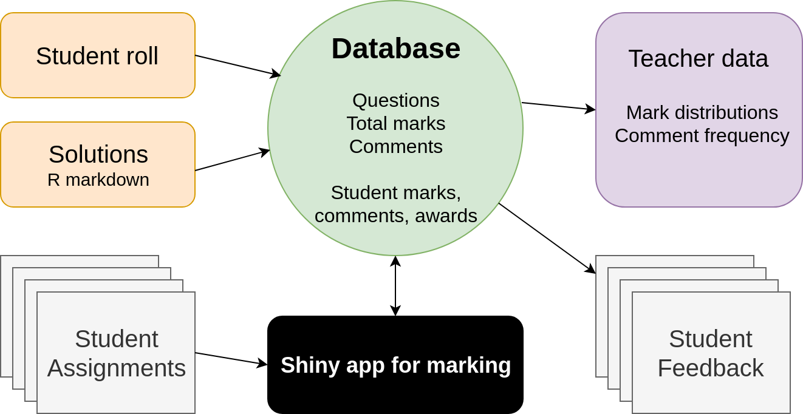

# Idea

- Marking digitially is slower than pen and paper

- You still have to manually add and enter marks

- Surely we can do better?

---

```{r, echo=FALSE}

```

---
class: inverse, middle, center

# Demo
---

# Advantages

- Faster than annotating PDFs

- Automatic mark collation and entry

- Per-question/comment feedback for students and teachers

- Randomised order, order effects, marker effects data are free

---

# Disadvantages

- Feedback is in a separate file to the PDF

- Feedback is less student-specific

---
class: inverse, middle, center

# Questions

from someone who hasn't asked one already?